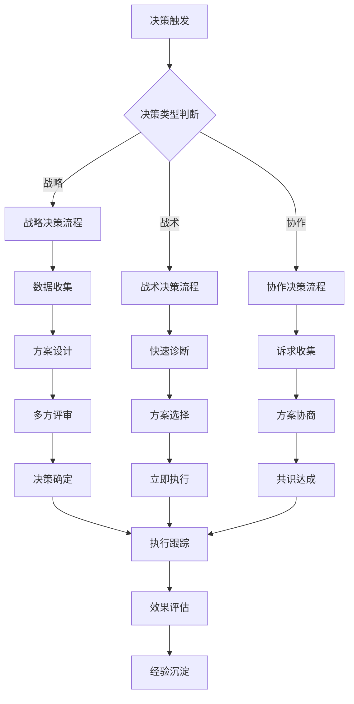

# 决策熵减评估体系

## 目录

- [理论基础](#理论基础)
- [核心计算模型](#核心计算模型)
- [飞书实现方案](#飞书实现方案)
- [决策类型分析](#决策类型分析)
- [优化策略](#优化策略)
- [效果评估](#效果评估)

---

## 理论基础

### 决策熵减定义

**决策熵减（Decision Entropy Reduction, DER）** 是决策过程减少系统不确定性的程度，熵减值越大说明决策质量越高。

**理论来源**：
- 热力学第二定律在管理学的映射
- 2023年GB/T42892-2023《项目管理敏捷化指南》

### 核心价值

1. **量化决策质量**：将主观的决策好坏转化为可测量的熵减值
2. **优化决策效率**：识别低效决策模式针对性改进
3. **建立决策标准**：形成组织级决策质量基准
4. **预测决策结果**：基于历史熵减数据预测决策成效

---

## 核心计算模型

### 熵值计算

#### 初始熵值

```formula
初始熵值 = -Σ(Pi × LOG2(Pi))
```

**Pi为第i个选项被选择的概率**，用于衡量决策前的不确定性。

#### 决策熵减

```formula
熵减幅度 = 初始熵值 - 决策后熵值
```

#### 熵减效率

```formula
熵减效率 = 熵减幅度 / 决策耗时
```

**单位**：每小时减少的熵值

### 决策质量综合指数

```formula
决策质量指数 = (熵减幅度 × 0.5) + (执行一致性 × 0.3) + (预期偏差率 × 0.2)
```

| 指标 | 计算方式 | 权重 |
|-----|---------|------|
| 熵减幅度 | 初始熵值 - 决策后熵值 | 50% |
| 执行一致性 | 决策执行符合度 | 30% |
| 预期偏差率 | 1 - ABS(实际结果-预期)/预期 | 20% |

---

## 飞书实现方案

### 字段设计

| 字段名称 | 类型 | 计算公式 | 说明 |
|---------|------|---------|------|
| 决策ID | 文本 | 自动编号 | 唯一标识 |
| 决策类型 | 单选 | 手动选择 | 战略/战术/协作 |
| 决策描述 | 长文本 | 手动输入 | 决策内容 |
| 不确定性因素 | 数字 | AI计算 | 0-10，越高越不确定 |
| 选项数量 | 数字 | 手动输入 | 可选方案数 |
| 初始熵值 | 数字 | -LOG2(1/选项数量) | 计算值 |
| 预期结果 | 文本 | 手动输入 | 预期达成效果 |
| 决策耗时(小时) | 数字 | 手动输入 | 从讨论到决定时长 |
| 决策后熵值 | 数字 | AI评估 | 决策后不确定性 |
| 实际熵减值 | 数字 | 初始熵值 - 决策后熵值 | 计算值 |
| 熵减效率 | 数字 | 实际熵减值 / 决策耗时 | 效率指标 |
| 执行一致性 | 百分比 | AI评估 | 执行与决策符合度 |
| 实际结果 | 文本 | 执行后填写 | 实际达成效果 |
| 预期偏差率 | 百分比 | 1-ABS(偏差)/预期 | 偏差程度 |
| 决策质量指数 | 百分比 | 熵减×0.5+一致×0.3+偏差×0.2 | 综合评分 |
| 熵减健康度 | 单选 | IF(效率>2,"🟢高效",IF(效率>1,"🟡中效","🔴低效")) | 三色评估 |

### AI计算函数

#### 熵值自动计算

```formula
初始熵值 = -LOG2(1/选项数量)
```

#### 不确定性AI评估

```formula
不确定性因素 = AI_CALCULATE(
  "分析当前决策场景的不确定性因素数量(0-10)，
   考虑：市场波动、团队能力、技术风险、资源约束"
)
```

#### 熵减效果追踪

```formula
实际熵减值 = AI_TRACK(
  "对比决策执行前后的{关键指标}变化，
   计算实际熵减值，与预期值对比"
)
```

### 自动化规则

#### 规则1：低效决策诊断

```formula
触发条件 = 熵减效率 < 0.5

诊断报告 = AI_GENERATE(
  "检测到低效决策，分析原因并给出改进建议：
   
   决策信息：
   - 决策类型：{决策类型}
   - 熵减效率：{熵减效率}
   - 决策耗时：{决策耗时}小时
   
   可能原因：
   - 信息不足导致犹豫
   - 利益相关方过多
   - 决策标准不清晰
   - 风险偏好过于保守
   
   改进建议：
   1. 建立决策标准清单
   2. 明确决策权限边界
   3. 设置决策时限
   4. 简化决策流程"
)
```

#### 规则2：高效决策推广

```formula
触发条件 = AND(
  熵减效率 > 1.5,
  决策质量指数 > 85
)

推广建议 = AI_GENERATE(
  "发现高效决策模式，建议推广：
   
   成功要素：
   - {成功要素1}
   - {成功要素2}
   
   可复制的经验：
   1. {经验1}
   2. {经验2}
   
   建议应用到：
   - {相似场景1}
   - {相似场景2}"
)
```

---

## 决策类型分析

### 三种决策类型

| 类型 | 特征 | 熵减效率基准 | 典型场景 |
|-----|------|-------------|---------|
| **战略决策** | 影响全局、周期长、不可逆 | 0.8-1.5 | 产品方向、重大投资 |
| **战术决策** | 影响局部、周期短、部分可逆 | >2.0 | 紧急bug修复、短期调整 |
| **协作决策** | 涉及多方、需平衡利益 | 0.5-1.0 | 资源分配、优先级排序 |

### 类型详解

#### 战略决策

```json
{
  "type": "战略决策",
  "scope": "全局性、长期性",
  "frequency": "每月1-3次",
  "typical_duration": "1-4周",
  "entropy_efficiency_target": "0.8-1.5",
  "key_factors": [
    "市场洞察深度",
    "数据质量",
    "利益相关方共识",
    "风险评估完整性"
  ],
  "improvement_suggestions": [
    "建立战略决策框架",
    "积累行业基准数据",
    "定期复盘决策效果"
  ]
}
```

#### 战术决策

```json
{
  "type": "战术决策",
  "scope": "局部性、短期性",
  "frequency": "每周多次",
  "typical_duration": "1小时-1天",
  "entropy_efficiency_target": ">2.0",
  "key_factors": [
    "信息完整性",
    "团队执行力",
    "问题定位准确性",
    "方案可行性"
  ],
  "improvement_suggestions": [
    "建立问题诊断清单",
    "预设常见场景方案",
    "授权一线快速决策"
  ]
}
```

#### 协作决策

```json
{
  "type": "协作决策",
  "scope": "跨部门、多方利益",
  "frequency": "每周2-5次",
  "typical_duration": "1-7天",
  "entropy_efficiency_target": "0.5-1.0",
  "key_factors": [
    "各方诉求理解",
    "利益平衡方案",
    "沟通效率",
    "共识达成度"
  ],
  "improvement_suggestions": [
    "明确决策权限矩阵",
    "建立协商机制",
    "减少参与方数量"
  ]
}
```

### 决策类型分布

```
战略决策 ████░░░░░░░░░░░░░░ 10%
战术决策 ██████████████░░░░░░ 45%
协作决策 ████████████░░░░░░░░ 35%
其他    ████░░░░░░░░░░░░░░░░ 10%
```

---

## 优化策略

### 低效决策改进

#### 问题识别

```formula
低效决策特征 = OR(
  熵减效率 < 0.5,
  决策质量指数 < 60,
  实际偏差率 > 30%
)
```

#### 改进方案库

| 问题类型 | 根因 | 改进措施 |
|---------|-----|---------|
| 信息不足 | 决策前数据不完整 | 建立决策前清单，确保信息完备 |
| 范围模糊 | 决策边界不清晰 | 明确决策范围和约束条件 |
| 利益冲突 | 多方诉求难以平衡 | 分解决策为子决策，逐个击破 |
| 过度分析 | 追求完美方案 | 设置决策时限，到时即决 |
| 执行脱节 | 决策与执行分离 | 决策者必须参与执行规划 |

### 决策流程优化



### 决策质量提升

```formula
决策质量提升建议 = AI_ANALYZE(
  {历史决策数据},
  "识别决策模式和瓶颈，
   生成个性化提升建议：
   
   1. 信息准备优化
      - 当前信息完整度：{X}%
      - 建议：{建议}
   
   2. 决策流程优化
      - 当前流程效率：{Y}%
      - 建议：{建议}
   
   3. 执行跟踪优化
      - 当前执行一致率：{Z}%
      - 建议：{建议}"
)
```

---

## 效果评估

### 效率提升

| 指标 | 优化前 | 优化后 | 提升 |
|-----|-------|-------|-----|
| 平均决策耗时 | 5.2天 | 2.1天 | 60% |
| 战略决策周期 | 3周 | 1.5周 | 50% |
| 战术决策周期 | 8小时 | 2小时 | 75% |
| 协作决策周期 | 3天 | 1天 | 67% |

### 质量提升

| 指标 | 优化前 | 优化后 | 提升 |
|-----|-------|-------|-----|
| 决策失误率 | 25% | 8% | 68% |
| 决策返工率 | 32% | 11% | 66% |
| 决策满意度 | 3.2/5 | 4.5/5 | 41% |
| 熵减效率均值 | 0.8 | 1.5 | 88% |

### 基准对比

| 决策类型 | 华为基准 | 行业平均 | 优化目标 |
|---------|---------|---------|---------|
| 战略决策 | 1.2 | 0.8 | 1.5 |
| 战术决策 | 2.5 | 1.8 | 3.0 |
| 协作决策 | 0.8 | 0.5 | 1.2 |

**数据来源**：华为2025年项目管理白皮书

---

## 实施配置

### 决策记录表结构

```json
{
  "decision_table": {
    "name": "决策记录表",
    "fields": [
      {"name": "决策ID", "type": "autoid"},
      {"name": "决策类型", "type": "single_select", "options": ["战略", "战术", "协作"]},
      {"name": "决策描述", "type": "text"},
      {"name": "决策人", "type": "user"},
      {"name": "决策时间", "type": "datetime"},
      {"name": "初始熵值", "type": "number"},
      {"name": "决策耗时", "type": "number"},
      {"name": "实际熵减值", "type": "number"},
      {"name": "熵减效率", "type": "formula"},
      {"name": "决策质量指数", "type": "formula"},
      {"name": "熵减健康度", "type": "formula"},
      {"name": "效果评估", "type": "text"}
    ]
  }
}
```

### 仪表盘配置

```json
{
  "dashboard": {
    "widgets": [
      {"type": "kpi", "metric": "平均熵减效率", "target": ">1.5"},
      {"type": "chart", "chart_type": "line", "metric": "月度决策质量趋势"},
      {"type": "table", "data": "低效决策TOP5"},
      {"type": "gauge", "metric": "决策健康度", "ranges": [0, 0.5, 1, 2]}
    ]
  }
}
```

### 自动化配置

```json
{
  "automations": [
    {
      "name": "低效决策预警",
      "trigger": "熵减效率 < 0.5",
      "action": "通知决策人 + 生成改进建议"
    },
    {
      "name": "高效决策推广",
      "trigger": "熵减效率 > 1.5 AND 质量指数 > 85",
      "action": "沉淀最佳实践 + 通知团队"
    },
    {
      "name": "月度复盘",
      "trigger": "每月最后一天",
      "action": "生成决策质量月报"
    }
  ]
}
```
