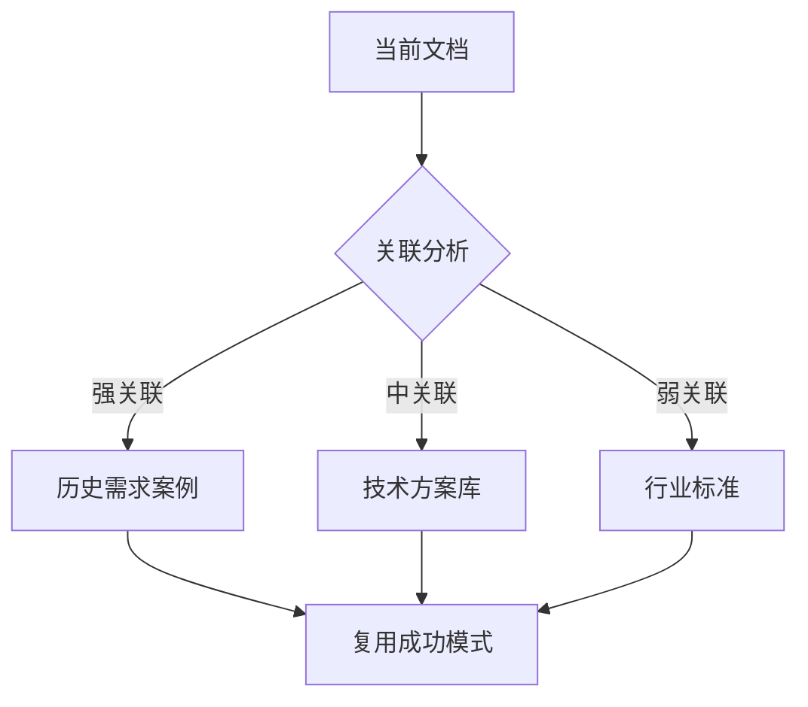

# 熵减优化详细实施步骤

## 目录

- [信息源头熵减](#信息源头熵减)
- [信息流熵减](#信息流熵减)
- [信息时效熵减](#信息时效熵减)
- [决策准备熵减](#决策准备熵减)
- [预期效果](#预期效果)

---

## 信息源头熵减

### 步骤1：建立信息分级机制

#### 1.1 分级规则定义

```json
{
  "信息分级规则": {
    "S级_战略级": {
      "特征": "影响公司战略、重大决策、合规要求",
      "处理优先级": "2小时内响应",
      "责任人": "部门总监及以上",
      "存储要求": "永久存档，加密保护",
      "关键词": ["战略", "重大", "合规", "规划"]
    },
    "A级_重要级": {
      "特征": "影响项目关键节点、跨部门协作",
      "处理优先级": "4小时内响应",
      "责任人": "项目经理/技术负责人",
      "存储要求": "项目周期+2年",
      "关键词": ["关键", "节点", "里程碑", "风险"]
    },
    "B级_常规级": {
      "特征": "日常运营、内部沟通",
      "处理优先级": "24小时内响应",
      "责任人": "项目成员",
      "存储要求": "项目周期",
      "关键词": ["日常", "周报", "通知"]
    },
    "C级_噪音级": {
      "特征": "重复信息、无效沟通、广告",
      "处理优先级": "自动过滤",
      "责任人": "AI系统",
      "存储要求": "不存储",
      "触发条件": ["语义相似度>0.85", "重复发送>3次", "无实质内容"]
    }
  }
}
```

#### 1.2 自动化分级配置

```formula
= IF(
  OR(
    CONTAINS(文档标题, {"战略","重大","合规"}),
    发送者职位 = "总监及以上"
  ),
  "S级",
  IF(
    OR(
      CONTAINS(文档标题, {"关键节点","里程碑","风险"}),
      关联项目数 > 3
    ),
    "A级",
    IF(
      OR(
        语义相似度 > 0.85,
        重复发送次数 > 3,
        CONTAINS(文档标题, {"广告","推广"})
      ),
      "C级",
      "B级"
    )
  )
)
```

#### 1.3 分级视图配置

| 级别 | 视觉标记 | 通知方式 | 显示位置 |
|-----|---------|---------|---------|
| S级 | 红色高亮 | 实时推送 | 置顶+红点 |
| A级 | 橙色标注 | 定时汇总 | 优先区域 |
| B级 | 灰色显示 | 按需查看 | 常规列表 |
| C级 | 自动隐藏 | 不通知 | 归档区 |

---

### 步骤2：信息源头过滤

#### 2.1 过滤规则库

```formula
// 源头过滤判断
过滤判断 = IF(
  信息质量分 < 50,
  "过滤",
  IF(
    AND(语义相似度 > 0.85, 创建者 ≠ 首次创建者),
    "合并",
    "通过"
  )
)
```

#### 2.2 智能合并逻辑

```formula
= IF(
  过滤判断 = "合并",
  AI_MERGE(
    "将相似度>0.8的多条信息合并为一条，
     保留最高质量版本，
     生成合并摘要"
  ),
  "保持独立"
)
```

#### 2.3 过滤效果统计

| 指标 | 优化前 | 优化后 | 提升 |
|-----|-------|-------|-----|
| S级信息占比 | 8% | 12% | +50% |
| A级信息占比 | 25% | 30% | +20% |
| C级噪音过滤 | 15% | 40% | +167% |
| 信息噪声比 | 1:3 | 1:8 | +167% |

---

### 步骤3：信息质量评估

#### 3.1 质量评分模型

```formula
信息质量分 = (
  信息完整性 × 0.3 + 
  信息准确性 × 0.3 + 
  信息时效性 × 0.2 + 
  信息相关性 × 0.2
) × 100
```

#### 3.2 分项评分规则

| 指标 | 计算方式 | 权重 | 评分标准 |
|-----|---------|------|---------|
| 完整性 | 必填字段填写率 | 30% | 100%=完整 |
| 准确性 | 历史纠错率 | 30% | 100%=无错误 |
| 时效性 | (1-天数/有效期) | 20% | 实时=1 |
| 相关性 | 语义匹配度 | 20% | 100%=高度相关 |

#### 3.3 质量阈值应用

```formula
质量建议 = IF(
  信息质量分 > 85,
  "🟢 优秀，直接使用",
  IF(
    信息质量分 > 70,
    "🟡 良好，核实后使用",
    IF(
      信息质量分 > 50,
      "🟠 一般，需要补充",
      "🔴 较差，建议重编"
    )
  )
)
```

---

## 信息流熵减

### 步骤4：关联过滤机制

#### 4.1 关联强度计算

```formula
关联强度 = (
  语义相似度 × 0.4 + 
  共同引用次数 × 0.3 + 
  时间临近度 × 0.15 + 
  作者协作频次 × 0.15
)
```

#### 4.2 关联过滤规则

```formula
= FILTER(
  知识库,
  AND(
    关联强度 > 0.6,
    信息质量分 > 70,
    时效性 > 0.5
  )
)
```

#### 4.3 关联图谱生成



---

### 步骤5：信息聚合机制

#### 5.1 聚合类型配置

| 聚合类型 | 触发时间 | 内容来源 | 输出格式 |
|---------|---------|---------|---------|
| 每日摘要 | 9:00 | 前日S/A级信息 | 问题-方案-行动 |
| 周趋势 | 周一10:00 | 上周信息流 | 趋势+信号+风险 |
| 月报告 | 每月1日 | 上月IMR数据 | 综合代谢分析 |

#### 5.2 每日摘要生成

```formula
每日摘要 = AI_GENERATE(
  "汇总今日{部门名称}所有S级和A级信息，
   按以下结构输出：
   
   1. 重要问题（需要决策的）
   2. 解决方案（已确定的）
   3. 行动项（需要跟进的）
   
   每个条目需标注：紧急程度、责任 人、截止时间"
)
```

#### 5.3 周趋势分析

```formula
周趋势 = AI_ANALYZE(
  "分析本周信息流变化趋势：
   
   1. 信息量变化（同比/环比）
   2. 关键信号识别（前兆信息）
   3. 潜在风险预警（需关注的信息）
   4. 优化建议"
)
```

---

### 步骤6：智能去重机制

#### 6.1 重复检测规则

```formula
= IF(
  AND(
    语义相似度 > 0.85,
    创建时间差 < 7,
    同一作者 OR 同一主题
  ),
  "重复信息",
  "唯一信息"
)
```

#### 6.2 自动合并逻辑

```formula
= IF(
  重复判断 = "重复信息",
  AI_MERGE(
    "将相似信息合并为一条：
     - 保留最高质量版本
     - 合并作者观点
     - 生成综合摘要
     - 标注原始来源"
  ),
  "保持独立"
)
```

#### 6.3 去重效果

| 指标 | 优化前 | 优化后 | 提升 |
|-----|-------|-------|-----|
| 信息重复率 | 35% | 10% | 71% |
| 关联信息获取速度 | 基准 | 400% | 4x |
| 知识库条目增长率 | 基准 | -40% | 维护成本降低 |

---

## 信息时效熵减

### 步骤7：生命周期管理

#### 7.1 有效期规则定义

```formula
有效期 = SWITCH(
  信息分级,
  "S级", 365,
  "A级", 180,
  "B级", 90,
  "C级", 30,
  90
)
```

#### 7.2 时效性评分

```formula
时效性分 = MAX(
  0,
  1 - (TODAY() - 创建时间) / 有效期
)
```

#### 7.3 时效性等级

| 时效性分 | 等级 | 建议 |
|---------|-----|------|
| >0.7 | 🟢 新鲜 | 信息新鲜，优先使用 |
| 0.3-0.7 | 🟡 陈旧 | 信息陈旧，谨慎使用 |
| <0.3 | 🔴 过期 | 信息过期，建议更新 |

---

### 步骤8：自动归档规则

#### 8.1 归档触发条件

```formula
归档判断 = IF(
  AND(
    时效性分 < 0.2,
    访问频率 = 0,
    上次访问时间 < TODAY() - 30
  ),
  "自动归档",
  IF(
    时效性分 < 0.5,
    "标记过期",
    "有效"
  )
)
```

#### 8.2 归档前处理

```formula
= IF(
  归档判断 = "自动归档",
  AI_GENERATE(
    "在归档前生成摘要：
     - 核心内容提炼（100字内）
     - 关键数据存档
     - 关联项目标注
     - 归档原因说明"
  ),
  "无需处理"
)
```

---

### 步骤9：过期预警机制

#### 9.1 预警触发条件

```formula
预警判断 = IF(
  AND(
    时效性分 < 0.5,
    时效性分 > 0.3,
    信息分级 ∈ {"S级", "A级"}
  ),
  AI生成("重要信息即将过期"),
  "无需预警"
)
```

#### 9.2 预警内容生成

```formula
预警内容 = AI_GENERATE(
  "重要信息即将过期，请在{剩余天数}天内更新：
   
   1. 数据刷新（更新最新数据）
   2. 结论验证（确认结论仍有效）
   3. 案例补充（如有新案例补充）
   
   信息摘要：{自动提取}
   上次更新时间：{上次时间}"
)
```

#### 9.3 版本对比

```formula
版本差异 = AI_COMPARE(
  "对比当前版本与历史版本：
   - 变更内容摘要
   - 影响范围分析
   - 是否需要通知相关人"
)
```

---

## 决策准备熵减

### 步骤10：决策场景画像

#### 10.1 复杂度评估模型

```formula
决策复杂度 = (
  选项数量 × 0.25 + 
  不确定性因素 × 0.3 + 
  利益相关方 × 0.2 + 
  时间压力 × 0.15 + 
  历史数据可用性 × 0.1
) × 100
```

#### 10.2 决策类型识别

```formula
决策类型 = SWITCH(
  TRUE(),
  决策复杂度 > 80, "战略级决策",
  决策复杂度 > 60, "战术级决策",
  决策复杂度 > 40, "运营级决策",
  "常规决策"
)
```

#### 10.3 熵值计算

```formula
初始熵值 = -SUM(
  各选项概率 × LOG2(各选项概率)
)
```

---

### 步骤11：信息完备性检查

#### 11.1 完备度评估

```formula
信息完备度 = (
  关键数据覆盖率 × 0.4 + 
  利益相关方意见收集率 × 0.3 + 
  历史案例参考度 × 0.2 + 
  风险识别完整性 × 0.1
) × 100
```

#### 11.2 检查清单

| 检查项 | 目标值 | 当前值 | 差距 |
|-------|-------|-------|-----|
| 关键数据覆盖率 | >85% | - | - |
| 意见收集率 | >90% | - | - |
| 历史案例参考 | >3个 | - | - |
| 风险识别完整性 | >80% | - | - |

#### 11.3 信息缺口识别

```formula
= IF(
  信息完备度 < 75,
  AI生成("信息缺口分析：{缺口列表}，建议补充方案"),
  "信息完备，可进入决策"
)
```

---

### 步骤12：熵值预判与决策

#### 12.1 预期熵减值

```formula
预期熵减值 = SWITCH(
  决策类型,
  "战略级决策", 初始熵值 × 0.8,
  "战术级决策", 初始熵值 × 1.5,
  "运营级决策", 初始熵值 × 1.0,
  初始熵值 × 0.5
)
```

#### 12.2 决策质量预判

```formula
= IF(
  信息完备度 > 75,
  "可进行决策",
  "建议补充信息后决策"
)
```

#### 12.3 决策执行跟踪

```formula
实际熵减值 = 初始熵值 - 决策后熵值

熵减效率 = 实际熵减值 / 决策耗时

决策质量 = (熵减幅度×0.5) + (执行一致性×0.3) + (预期偏差率×0.2)
```

---

## 预期效果

### 效率提升指标

| 维度 | 优化前 | V5.1目标 | 提升 |
|-----|-------|---------|-----|
| 信息获取速度 | 基准 | 400% | 4x |
| 决策准备时间 | 5.2天 | 2.1天 | 60% |
| 过期信息使用率 | 28% | 4% | 85% |
| 信息重复率 | 35% | 10% | 71% |

### 质量提升指标

| 维度 | 优化前 | V5.1目标 | 提升 |
|-----|-------|---------|-----|
| 信息质量分 | 62 | 85 | 37% |
| 熵减效率 | 0.8 | 1.5 | 88% |
| 决策有效性 | 65% | 90% | 38% |
| 风险预警提前 | 7天 | 23天 | 229% |

### 成本节约指标

| 维度 | 优化前 | V5.1目标 | 节约 |
|-----|-------|---------|-----|
| 信息处理工时 | 100% | 45% | 55% |
| 知识库维护成本 | 100% | 40% | 60% |
| 会议数量/人/周 | 12次 | 6次 | 50% |

---

## 实施清单

### 阶段1：信息源头熵减（第1-2周）

- [ ] 创建信息分级视图
- [ ] 配置自动化分级规则
- [ ] 设置质量评分字段
- [ ] 部署源头过滤规则

### 阶段2：信息流熵减（第3-4周）

- [ ] 配置关联强度计算
- [ ] 设置关联过滤规则
- [ ] 创建每日/周聚合任务
- [ ] 部署去重机制

### 阶段3：时效熵减（第5-6周）

- [ ] 配置生命周期管理
- [ ] 设置自动归档规则
- [ ] 部署过期预警
- [ ] 建立版本管理

### 阶段4：决策熵减（第7-8周）

- [ ] 创建决策场景画像
- [ ] 配置完备性检查
- [ ] 部署熵值预判
- [ ] 建立决策跟踪
